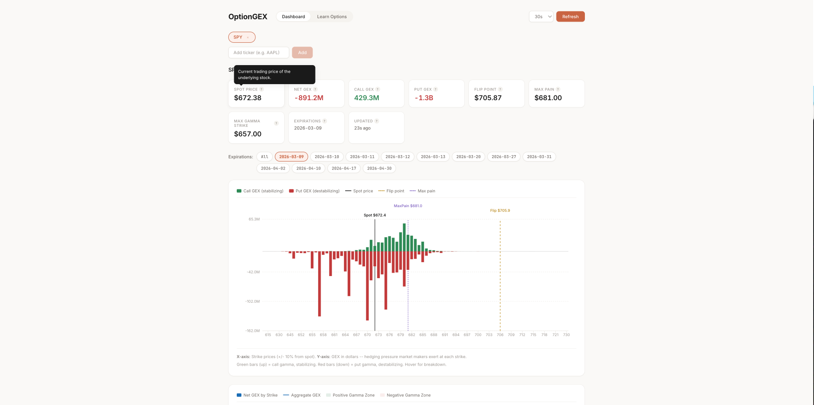
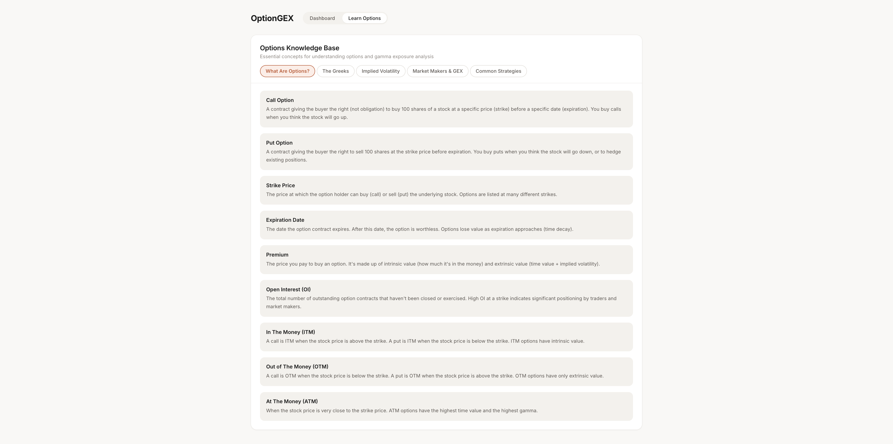

# OptionGEX - Real-Time Gamma Exposure Dashboard

Real-time stock option Gamma Exposure (GEX) analysis dashboard. GEX measures how market makers' delta hedging changes with price movement — a key indicator of support/resistance levels and potential volatility.

**[Live Demo](https://oasans.github.io/OptionGEX/)**


## Screenshots


*GEX bar chart with expiration filter, key metrics, and reference lines*


*Built-in options knowledge base*

## Features

- **GEX Bar Chart** — Per-strike gamma exposure with call (green) and put (red) breakdown
- **Aggregate GEX Chart** — Net GEX bars with cumulative aggregate line and positive/negative gamma zones
- **Open Interest Chart** — Call and put open interest by strike
- **Expiration Filter** — Multi-select expiration dates to analyze specific timeframes
- **Key Levels** — Spot price, gamma flip point, max pain, and max gamma strike
- **Auto-Refresh** — Configurable polling interval (15s / 30s / 60s)
- **Multi-Ticker** — Track up to 10 tickers simultaneously (SPY, AAPL, NVDA, etc.)
- **Metric Tooltips** — Hover any metric card for a plain-English explanation
- **After-Hours Detection** — Warns when market data is sparse or unavailable
- **Learn Options** — Built-in knowledge base covering Greeks, IV, GEX mechanics, and common strategies
- **Free Data** — Uses Yahoo Finance via yfinance (no API key needed)

## Tech Stack

| Layer | Tech |
|-------|------|
| Backend | Python, FastAPI, yfinance, Black-Scholes gamma calc |
| Frontend | React, TypeScript, Recharts, Vite |
| Deployment | Render (backend), GitHub Pages (frontend) |
| Analytics | GoatCounter |

## Local Development

### Backend

```bash
cd backend
python -m venv venv
source venv/bin/activate   # Windows: venv\Scripts\activate
pip install -r requirements.txt
uvicorn app.main:app --reload
```

Backend runs on http://localhost:8000

### Frontend

```bash
cd frontend
npm install
npm run dev
```

Frontend runs on http://localhost:5173 (proxies `/api` to backend)

## How It Works

### GEX Calculation

For each option contract across up to 12 expirations:

```
GEX = gamma × open_interest × 100 × spot² × 0.01
```

- **Calls** contribute positive (stabilizing) gamma — market makers sell rallies, buy dips
- **Puts** contribute negative (destabilizing) gamma — market makers sell dips, buy rallies

Since yfinance doesn't provide gamma directly, it's calculated from implied volatility using Black-Scholes:

```
gamma = φ(d1) / (S × σ × √T)
```

### Charts

| Chart | Description |
|-------|-------------|
| **GEX by Strike** | Call GEX (green, up) and put GEX (red, down) per strike price |
| **Aggregate GEX** | Net GEX bars + right-to-left cumulative line showing overall gamma profile |
| **Open Interest** | Call OI (up) and put OI (down) per strike |

### Key Metrics

| Metric | Meaning |
|--------|---------|
| **Net GEX** | Total gamma exposure. Positive = low vol, negative = high vol |
| **Flip Point** | Price where net GEX changes sign. Above = calm, below = volatile |
| **Max Pain** | Strike minimizing total option holder payout. Stocks gravitate here near expiry |
| **Max Gamma Strike** | Strike with highest absolute net gamma. Strong support/resistance level |

See [GLOSSARY.md](GLOSSARY.md) for detailed explanations of all metrics.

## Deployment

### Backend (Render)

1. Go to [render.com](https://render.com) → New Web Service
2. Connect the GitHub repo, set root directory to `backend`
3. Build command: `pip install -r requirements.txt`
4. Start command: `uvicorn app.main:app --host 0.0.0.0 --port $PORT`
5. Note the deployed URL (e.g., `https://optiongex.onrender.com`)

### Frontend (GitHub Pages)

1. Go to repo Settings → Pages → Source: **GitHub Actions**
2. Go to Settings → Secrets and variables → Actions → Variables tab
3. Add repository variable: `VITE_API_URL` = your Render backend URL
4. Push to `main` — the workflow auto-deploys to GitHub Pages

## Running Tests

```bash
cd backend
pip install pytest
python -m pytest tests/
```

## Rate Limits

Each ticker uses ~6 Yahoo Finance calls per refresh (1 quote + 1 expirations + up to 12 chains). The backend limits concurrent tickers to 10.
